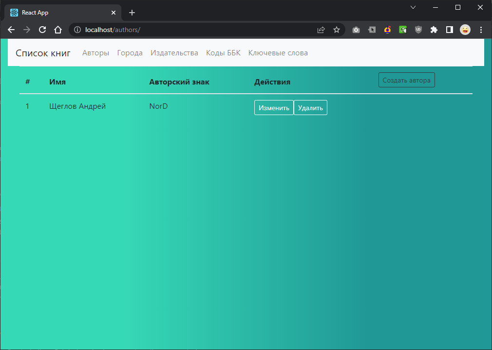

# docker_homework
### Description
1. Dockerfile должны быть написаны согласно пройденным best practices
2. Для docker-compose необходимо использовать локальное image registry
3. В docker-compose необходимо сетевые настройки 2 разных интерфейса(bridge), 1 - для фронта, 2 - для бека с postgresql

4.* Осущиствить сборку проекта самим docker-compose команда docker-compose build(при использовании этого подхода необходимо исключить 2 пункт из критерии оценки)

### Building from a Docker-compose and launching
```
git clone https://github.com/nordz0r/docker_homework/
docker-compose build
docker-compose up -d
```


### Tested
Open http://localhost/bbks

Tested on Debian 11 WSL2 (Windows 10)



